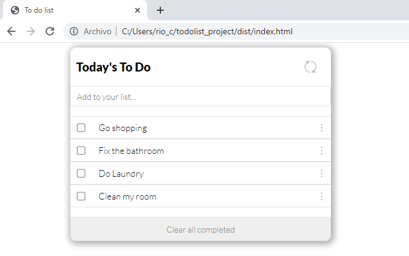

# To do list - project

> Creating an Awesome Books Page

First project from Figma template

## Built With

- Html, Javascript, CSS
- Webpack
- Developed in VSCode

To get a local copy up and running follow these simple example steps.
Run:
- `git clone https://github.com/hunter4466/todolist_project.git`
- `cd todolist_project`
-`Install node_modules, run npm install and install the latest node version`
-`Install webpack package`
- Open ./dist/index.html in browser

## Authors

👤 **Author**

- Mario Chois: [@githubhandle](https://github.com/hunter4466)

## 🤝 Contributing

- Mario Chois: [@githubhandle](https://github.com/hunter4466)

Contributions, issues, and feature requests are welcome!

Feel free to check the [issues page](https://github.com/hunter4466/todolist_project/issues).

## Show your support

Give a ⭐️ if you like this project!

## 📝 License

This project is [MIT](./MIT.md) licensed.